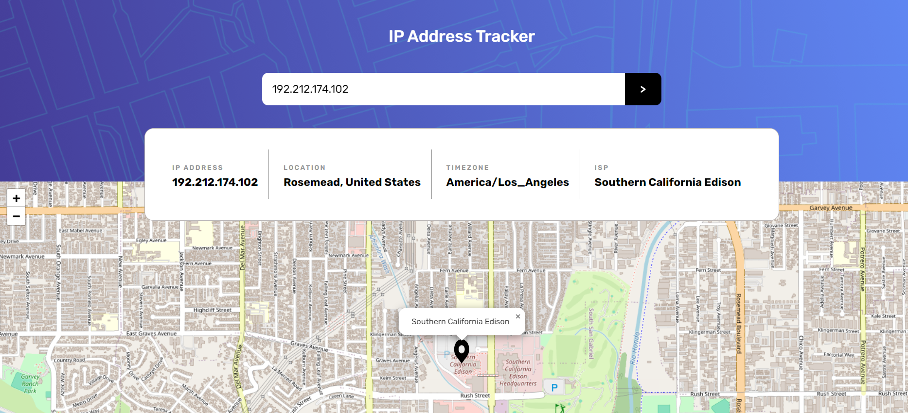

# Frontend Mentor - IP address tracker solution

This is a solution to the [IP address tracker challenge on Frontend Mentor](https://www.frontendmentor.io/challenges/ip-address-tracker-I8-0yYAH0)

## Table of contents

- [Overview](#overview)
  - [Screenshot](#screenshot)
  - [Links](#links)
  - [Built with](#built-with)
  - [What I learned](#what-i-learned)

## Overview

- The IP Address Tracker is a web application designed to track the geographical location of any IP address or domain name. It provides users with real-time information about the location, timezone, and ISP associated with the input IP address or domain

### Screenshot

# mobile

# desktop

### Links

- Solution URL: [Add solution URL here](https://github.com/Dwidenbrahma/ip-tracker)
- Live Site URL: [Add live site URL here](https://your-live-site-url.com)

### Built with

- Semantic HTML5 markup
- CSS custom properties
- Flexbox
- Mobile-first workflow

### What I learned

# Responsive Design with Media Queries:

- Learned how to create responsive layouts using CSS media queries to adapt the design based on different screen sizes.

# Asynchronous Data Fetching

- Implemented asynchronous data fetching using fetch() to retrieve location data from an external API (e.g., IP-API.com).

# CSS Variables

- Utilized CSS custom properties (variables) for defining color values, allowing for easy theming and consistency across the project.
